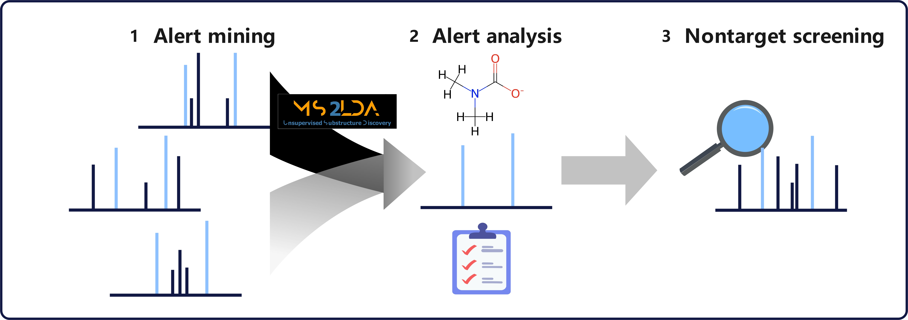
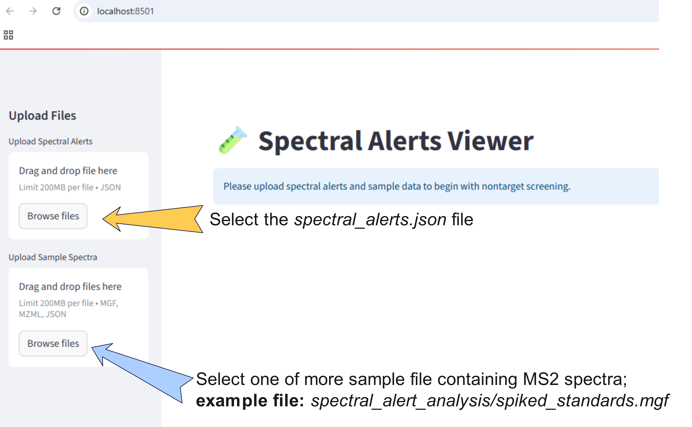
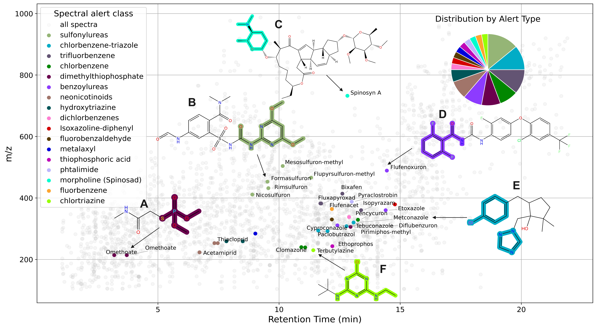
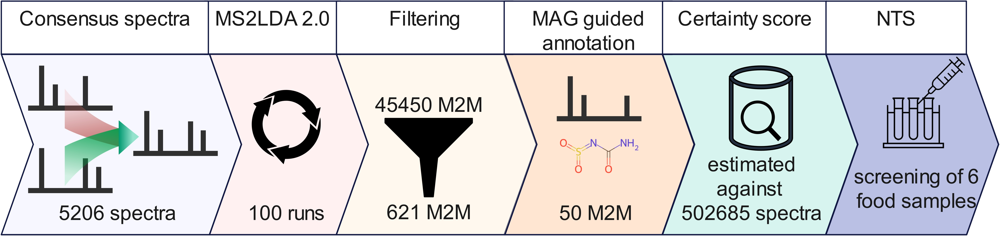

# ⚡ Spectral Alerts

Spectral Alerts describe MS² fragmentation patterns that can be linked to toxicologically relevant substructures. Think of them as the MS² counterpart of structural alerts 🧩 — but for spectra!

The Spectral Alerts presented here were mined using MS2LDA 2.0 and are intended to be used for nontarget screening workflows for pesticides and contaminantes.
📄 Read the full publication here (coming soon)

 

---

## ✨ Why use Spectral Alerts?

⚡ Fast querying – instantly match alerts in your samples

🎯 Efficient filtering – reduce your candidate space by more then 98%

🔍 Easy interpretation – alerts are easy to explain and explore

⚠️ Important caveat: make sure your substructures of interest are covered.
Our initial focus was pesticides, but the workflow can be extended to other compound classes.

---

## 🚀 Quickstart

Clone the repository and launch the app with Streamlit:

```bash
git clone https://github.com/j-a-dietrich/Spectral-Alerts.git
cd Spectral-Alerts
pip install -r requirements.txt
streamlit run spectral_alerts.py
```

Your browser will open automatically 🌐



---

## 🗂️ What do they cover?

Below you can find all 50 Spectral Alerts mined with MS2LDA 2.0. Three Spectral Alerts also contain losses not shown in the figure below. They can be found in the spectral_alert.json file.


---

## 📈 Analysis Results
The result below show the use of spectral alerts in a nontarget screening procedure on a pesticide spiked tomato sample. This is not the output of the Spectral Alert Viewer! To generate the results below, go to *spectral_alerts_analysis* → *nontarget screening* → *tomato200ppb_NTS.ipynb*.



---

## 🔬 How to Mine & Contribute New Alerts

Following the worfklow below, we generated the all available spectral alerts for nontarget screening. 



We welcome contributions!
If you want to submit your spectral alerts mined with MS2LDA 2.0:

📦 Prepare your MS² dataset (if needed consensus spectra or preprocessing)

🧮 Run MS2LDA 2.0 for motif extraction (can be run multiple times as for this study or once)

🧩 Curate & validate meaningful alerts (we focus here on pesticides or food related contaminants)

📤 Submit your alerts via Pull Request or create an issue

---

## 📬 Get in Touch

💡 Questions, ideas, or contributions? Open an issue.

---

## 📚 Citation

If you use Spectral Alerts in your research, please cite our work:

coming soon