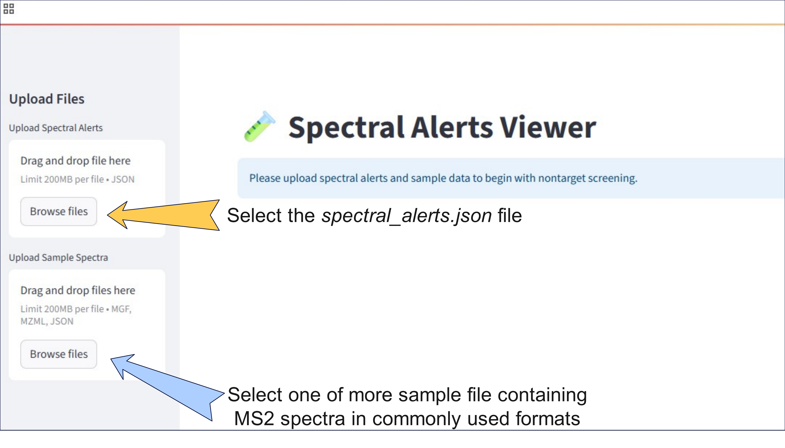
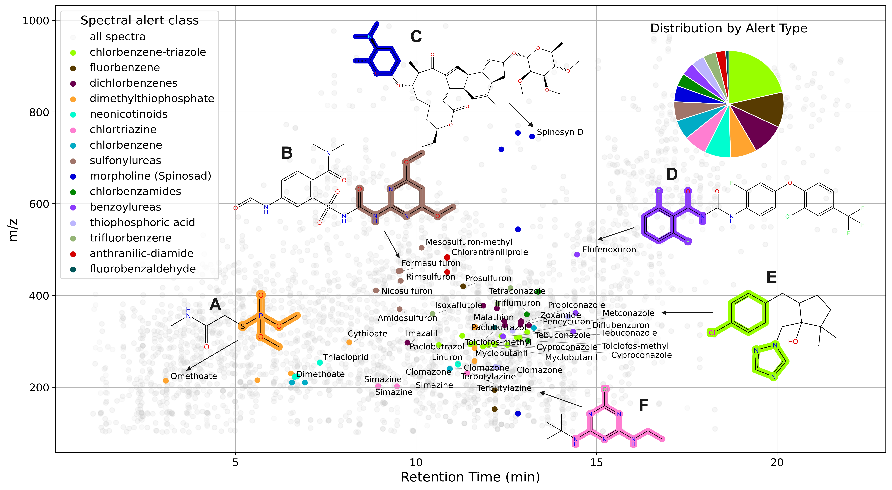

# ⚡ Spectral Alerts

Spectral Alerts describe MS² fragmentation patterns that can be linked to toxicologically relevant substructures. Think of them as the MS² counterpart of structural alerts 🧩 — but for spectra!

The Spectral Alerts presented here were mined using MS2LDA 2.0 and are intended to be used for nontarget screening workflows for pesticides and contaminantes.
📄 Read the full publication here

 

---

## ✨ Why use Spectral Alerts?

⚡ Fast querying – instantly match alerts in your data

🎯 Efficient filtering – reduce your candidate space by up to 98%

🔍 Easy interpretation – alerts are easy to explain and explore

⚠️ Important caveat: make sure your substructures of interest are covered.
Our initial focus was pesticides, but the workflow can be extended to other compound classes.

---

## 🚀 Quickstart

Clone the repository and launch the app with Streamlit:

```bash
git clone https://github.com/j-a-dietrich/Spectral-Alerts.git
cd Spectral-Alerts
pip install -r requirements.txt
streamlit run spectral_alerts.py
```

Your browser will open automatically 🌐



---

## 🗂️ What do they cover?


---

## 📈 Analysis Results



---

## 🔬 How to Mine & Contribute New Alerts

We welcome contributions!
Follow this workflow to generate and submit new Spectral Alerts:

📦 Prepare your MS² dataset

🧮 Run MS2LDA 2.0 for motif extraction

🧩 Curate & validate meaningful alerts

📤 Submit your alerts via Pull Request

-workflow figure here (coming soon)-

---

📬 Get in Touch

💡 Questions, ideas, or contributions? Open an issue or reach out via GitHub Discussions

---

## 📚 Citation

If you use Spectral Alerts in your research, please cite our work:

coming soon